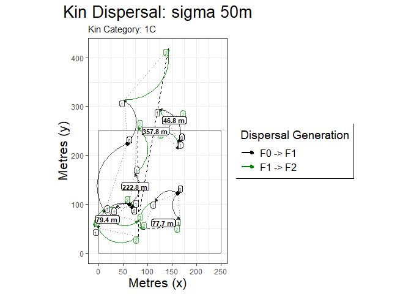

<!-- README.md is generated from README.Rmd. Please edit that file -->

# kindisperse

<!-- badges: start -->

<!-- badges: end -->

The goal of kindisperse is to simulate and estimate close-kin dispersal
kernels.

## Installation

You can install the released version of kindisperse from
[CRAN](https://CRAN.R-project.org) with: (in future. this doesn’t
currently exist)

``` r
install.packages("kindisperse")
```

And the development version from [GitHub](https://github.com/) with:

``` r
# install.packages("devtools")
devtools::install_github("moshejasper/kindisperse")
```

## Example

This is a basic example which shows you how to solve a common problem:

``` r
library(kindisperse)
library(ggplot2)
## basic example code
simulate_kindist_composite()
#> KINDISPERSE SIMULATION of KIN PAIRS
#> -----------------------------------
#> simtype:      composite 
#> kerneltype:       Gaussian 
#> category:         FS 
#> dims:             100 
#> juvsigma      100 
#> breedsigma        50 
#> gravsigma         50 
#> ovisigma      25 
#> lifestage:        larva 
#> 
#> tab
#> # A tibble: 100 x 11
#>    id1   id2      x1    y1     x2     y2 ls1   ls2   distance category  dims
#>    <chr> <chr> <dbl> <dbl>  <dbl>  <dbl> <chr> <chr>    <dbl> <chr>    <dbl>
#>  1 1a    1b    -14.2 89.4  -19.9   75.9  larva larva    14.7  FS         100
#>  2 2a    2b     30.9 74.3   87.6   83.4  larva larva    57.4  FS         100
#>  3 3a    3b     64.2  6.77  54.2  102.   larva larva    95.5  FS         100
#>  4 4a    4b     98.1 79.6  105.    15.3  larva larva    64.7  FS         100
#>  5 5a    5b     96.2 76.1   97.3   69.9  larva larva     6.24 FS         100
#>  6 6a    6b     69.8 82.1   92.8   78.9  larva larva    23.2  FS         100
#>  7 7a    7b     26.1 48.1    8.81  89.9  larva larva    45.2  FS         100
#>  8 8a    8b     90.6 40.9   74.0  104.   larva larva    65.3  FS         100
#>  9 9a    9b     67.3 33.6  -19.4    1.92 larva larva    92.3  FS         100
#> 10 10a   10b    40.8 32.8   84.1   42.3  larva larva    44.3  FS         100
#> # ... with 90 more rows
#> -----------------------------------
```

What is special about using `README.Rmd` instead of just `README.md`?
You can include R chunks like so:

``` r
summary(cars)
#>      speed           dist       
#>  Min.   : 4.0   Min.   :  2.00  
#>  1st Qu.:12.0   1st Qu.: 26.00  
#>  Median :15.0   Median : 36.00  
#>  Mean   :15.4   Mean   : 42.98  
#>  3rd Qu.:19.0   3rd Qu.: 56.00  
#>  Max.   :25.0   Max.   :120.00
```

You’ll still need to render `README.Rmd` regularly, to keep `README.md`
up-to-date.

You can also embed plots, for example:

    #> Loading required namespace: ggrepel



In that case, don’t forget to commit and push the resulting figure
files, so they display on GitHub\!
