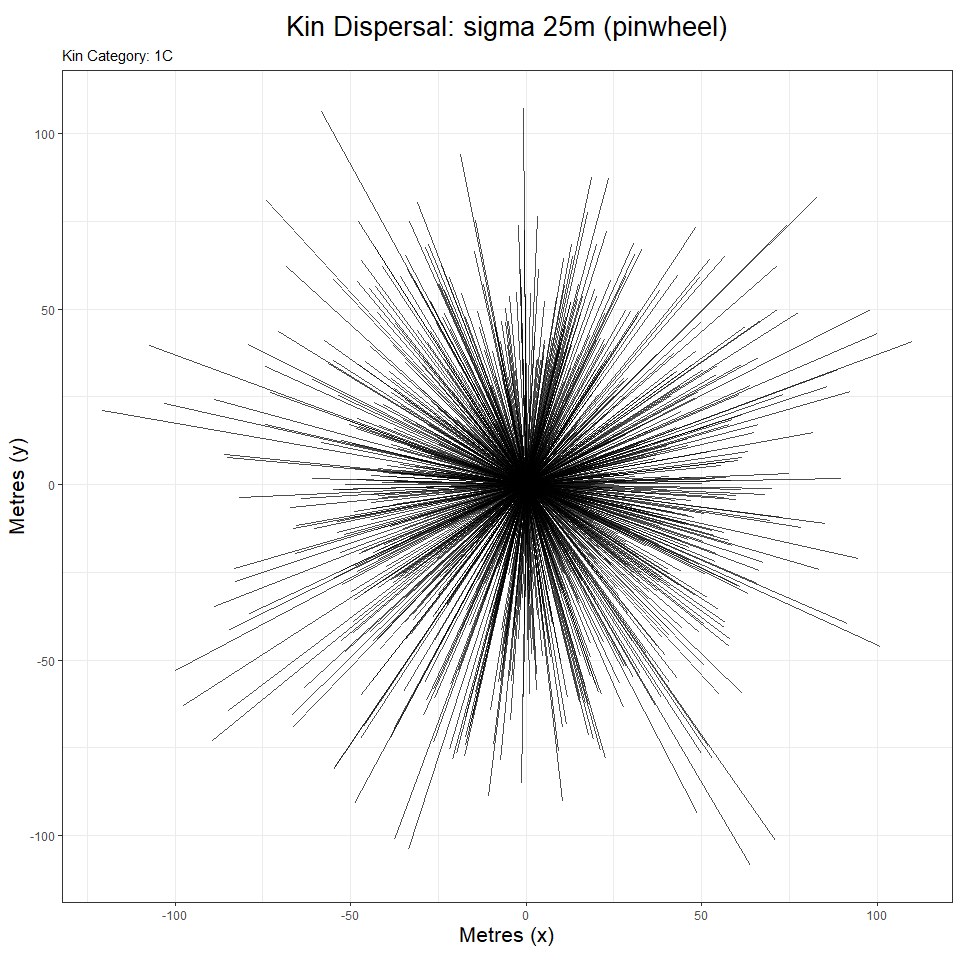
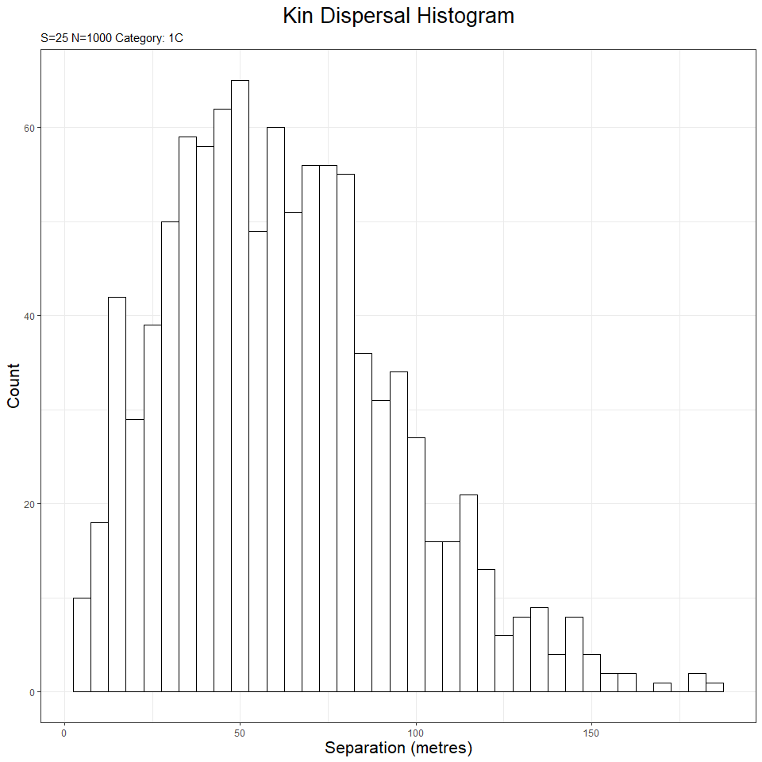

<!-- README.md is generated from README.Rmd. Please edit that file -->

# kindisperse

<!-- badges: start -->

<!-- badges: end -->

The goal of kindisperse is to simulate and estimate close-kin dispersal
kernels.

## Introduction

Dispersal is a key evolutionary process that connects organisms in space
and time. Assessing the dispersal of organisms within an area is an
important component of estimating risks from invasive species, planning
pest management operations, and evaluating conservation strategies for
threatened species.

Assessing the dispersal of small, abundant and short-lived animals such
as insects as traditionally been more difficult than for animals that
can be easily tagged. Responding to this challenge, researchers have
developed various methods based around mark-release-recapture that mark
the organisms with dyes, paint, or chemical tags, before releasing the
individuals and in various ways measuring the number of recaptures.

Such methods suffer the limitations of requiring manipulation of the
same individuals in which dispersal is being assessed, are
labour-intensive when conducted across a large enough area to be
informative, and typically are not estimates of true intergenerational
dispersal (which is measured life-stage ot lifestage, e.g. from the egg
of the parent to the egg of its offspring). Such lifestage-to-lifestage
estimates are important as they are readily interpretable within
established intergenerational analytical frameworks such as Wright’s
neighbourhood size.

Leveraging decreases in sequencing costs, out new method instead
estimates dispersal from the spatial distribution of close-kin. This
method requires that close kin dyads be identified and scored for two
variables: (i) the geographical distance between the two individuals in
the dyad, and (ii) their estimated order of kinship (1st order
e.g. full-sib; 2nd order e.g. half-sib; 3rd order e.g. first cousin).

Close-kin-based dispersal can provide an estimate of the
intergenerational (or parent-offspring) dispersal kernel - a key factor
that connects biological events across the lifespan of an organism with
broader demographic and population-genetic processes such as isolation
by distance. A dispersal kernel is the probability density function
describing the distributions of the locations of dispersed individuals
relative to the source point \[ref\]. Intergenerational dispersal
kernels themselves can be framed in terms of any number of breeding and
dispersal processes, defined by both reference lifestage and number of
generations, and leave their mark in the spatial distribution of various
categories of close kin, which can be treated as samplings from a set of
underlying kernels. Actual kernels vary, but are typically described in
terms of sigma, the second moment of the kernel, also known as its scale
parameter. More complex kernels can also incorporate a parameter for
shape or kurtosis (kappa), representing the fourth moment of the kernel.

In the case of an insect like the mosquito, the most basic
intergenerational kernel, the lifespan or parent-offspring kernel,
reflects all dispersal and breeding processes connecting (e.g.) the
larval location of a parent to the larval location of its offspring.
However, this kernel can be combined with additional breeding, dispersal
and sampling events to produce other, composite dispersal or
distribution kernels that contain information about intergenerational
dispersal. For example, the distribution of two larval full-sibling
mosquitoes reflects not a full lifespan of dispersal, but two ‘draws’
from the component kernel associated with the mother’s ovipositing
behaviour. Were we to sample the same full-sibling females as
ovipositing adults, this would instead represent two draws from a
composite ‘lifespan and additional oviposition’ kernel. Avuncular
larvae, should they exist, would represent draws from related but
distinct intergenerational dispersal kernels - an oviposition kernel,
and a composite ‘oviposition and lifespan’ kernel. The avuncular
distribution kernel would thus reflect a further compositing of these
dispersal events.

There is a rich literature examining the kernels of basic dispersal
events, and analysing them in terms of various kernel functions, whether
Gaussian, exponential, or others with differing properties and shapes,
often reflecting the tendency of dispersal events to be
disproportionately clustered around the source and/or be dispersed at
great distances from the source (i.e. for the kernel to be fat-tailed).
Most of this literature explores dispersal in terms of probability of a
dispersed sample being at a certain radius from the dispersed source. In
the case of close-kin recaptures of e.g. first cousins, we are instead
presented with dispersal events that must be approached in two
dimensions with respect to both radius of dispersal and additionally
angle of dispersal. A successful estimator of intergenerational
dispersal using close-kin recaptures must find strategies to decompose
the extraneous spatial and breeding components affecting the kernels,
and ultimately re-express dispersal in terms of an axial sigma - that
aspect of dispersal which operates within one dimension across a
two-dimensional space. This is the sigma component relied upon by Wright
for isolation by distance , and which is reflected in estimations of
neighbourhood area \[ref\].

The method we have developed relies upon the fact that different kinship
categories reflect different but related underlying intergenerational
dispersal composites, and uses the relationships between these kinship
distribution kernels to extract information about the core
parent-offspring dispersal kernel that produced the derivative kernels.
For example, the larval distribution kernel of full siblings differs
from the larval distribution of first cousins by a single lifespan:
using an additive variance framework, the first cousin variance that is
not accounted for by subtracting the full sibling variance constitutes
an estimate of the parent-offspring distribution, from which an
intergenerational kernel estimate can be derived. This is because both
larval full-sibling and larval first cousins are ‘phased’ with respect
to the organisms’ life cycle - that is, they are separated by an integer
multiple of parent-offspring dispersal events. It is this phasing that
enables the extraction of a ‘pure’ effective dispersal estimate, via the
additive property of variance. Other examples of phased relationships
include half sibling larvae to half cousin larvae (one cycle), full
libling larvae to second cousin larvae (two cycles), or even (for
mosquitoes) full sibling larvae to second cousin ovipositing adults
(three cycles).

Further details can be found in these papers \[ref\]

This package supplements these papers by supplying methods for (a)
importing and exporting information about distances & kinship
relationships for pairs of individuals, (b) estimating the axial
distribution (axial sigma for dispersal or position distributions) from
empirical distributions of kin-pairs, and (c) estimating the
intergenerational (parent-offspring) dispersal distribution (axial
sigma) that underlies the distributions of multiple phased kin
categories. This package also implements several simulation tools for
further exploring and testing the properties of intergenerational
dispersal kernels, as well as to assist in designing experiment layouts
& sampling schemes. Finally, for ease of use, the package supplies an
integrated shiny app which also implements the vast majority of package
functionality in a user-friendly interface.

## Installation

You can install the released version of kindisperse from
[CRAN](https://CRAN.R-project.org) with: (in future. this doesn’t
currently exist)

``` r
install.packages("kindisperse")
```

And the development version from [GitHub](https://github.com/) with:

``` r
# install.packages("devtools")
devtools::install_github("moshejasper/kindisperse")
```

Once installed, load the package as follows:

``` r
library(kindisperse)
#> kindisperse v0.6.2
```

## Simulations and Sampling

There are three simulation methods available: a graphical simulation of
dispersing families, and two simulations of kinpairs, one of a simple
kernel, the other of a composite one. There is one sampling method
available for study design.

### Graphical simulations

This is designed primarily for introducing, exploring, and easily
visualising dispersal concepts. It is packaged in two parallel
functions: the simulaiton function (simgraph\_data) and the
visualisation function(simgraph\_graph). A standard example of their use
is shown below:

``` r

## run graphical simulation
graphdata <- simgraph_data(nsims = 1000, dsigma = 25, dims = 250)
simgraph_graph(graphdata, nsim = 5, kinship = "1C", dsigma = 25)
```


However, the options of both can be tweaked to show other data types,
e.g. a pinwheel graph

``` r

graphdata <- simgraph_data(nsims = 1000, dsigma = 25, dims = 250)
simgraph_graph(graphdata, nsims = 1000, dsigma = 25, pinwheel = T, kinship = "1C")
```



or a histogram:

``` r

graphdata <- simgraph_data(nsims = 1000, dsigma = 25, dims = 250)
simgraph_graph(graphdata, nsims = 1000, dsigma = 25, histogram = T, kinship = "1C")
```



This function is also implemented in the ‘Tutorial’ tab of the
kindisperse app.

### Kinpair Simulations

These are designed for simulating and testing the impacts of various
dispersal and sampling parameters on a dataset, and for testing and
validating the estimation functions. They return an object of class
KinPairSimulation, which supplies a tibble (dataframe) of simulation
results, as well as metadata capturing the simulation parameters.

The simple simulation provides dispersals for each kin category based on
a simple parent-offspring dispersal sigma, with no attempt to
distinguish between the various breeding and dispersal events across a
lifespan. For this reason, it cannot distinguish between full and half
siblings (for example), and as larval full-siblings have not passed
through a full lifespan, it would render them as at distance 0 from
their parent (if they were in the adult oviposition stage, however, they
would be rendered as at one lifespans’ dispersal from parents).

Example usage is shown below:

``` r
simulate_kindist_simple(nsims = 5, sigma = 100, method = "Gaussian", kinship = "PO", lifestage = "larva")
#> KINDISPERSE SIMULATION of KIN PAIRS
#> -----------------------------------
#> simtype:      simple 
#> kerneltype:       Gaussian 
#> kinship:      PO 
#> simdims:      100 
#> dsigma:           100 
#> lifestage:        larva 
#> 
#> tab
#> # A tibble: 5 x 8
#>   id1   id2   kinship distance    x1    y1     x2     y2
#>   <chr> <chr> <chr>      <dbl> <dbl> <dbl>  <dbl>  <dbl>
#> 1 1a    1b    PO         108.  75.8   9.10   85.8 -98.0 
#> 2 2a    2b    PO         179.  29.9  64.9  -148.   43.0 
#> 3 3a    3b    PO          45.8 41.6  36.0    51.5  -8.64
#> 4 4a    4b    PO          66.0 31.7  27.6   -30.6   5.78
#> 5 5a    5b    PO         138.   7.08 31.1    70.3 -91.8 
#> -----------------------------------
```

The composite simulation defines four smaller dispersal movements which
make up the lifestage dispersal kernel. It distinguishes between full
and half siblings, cousins, etc. and handles larva that have only passed
through a fraction of the lifespan. The four phases are ‘juvenile’
(handling any dispersal between hatching and breeding), ‘breeding’
(movement across the breeding aspect of the cycle), ‘gravid’ (movement
after breeding but before deposition of young), and ‘oviposition’
(movement made while ovipositing/ bearing young). The addition of the
variances of these four kernels together consitutes the lifespan
dispersal kernel; the relationships between different categories inform
the phase. For example, full-siblings, whether sampled at oviposition or
larval states, differ in hatch position based on the ovipositing
movements of the mother (including e.g. skip oviposition in the case of
some mosquitoes). These categories (and any others containing a full-sib
relationship buried in the pedigree) are thus of the ‘full-sibling’ or
‘FS’ phase. Half siblings, in mosquitoes (which this package is
modelled on) are expected to be due to having the same father & separate
mothers: the last contribution of the father’s dispersal is at the
breeding stage, so the ‘HS’ phase are differentiated by the breeding,
gravid, & oviposition phases, but share in common the juvenile phase.
The parent-offspring ‘PO’ phase, on the other hand, share all (or none)
of the component dispersal distributions.

An example composite simulation is demostrated below:

``` r
simulate_kindist_composite(nsims = 5, juvsigma = 50, breedsigma = 30, gravsigma = 50, ovisigma = 10, method = "Laplace", kinship = "H1C", lifestage = "oviposition")
#> KINDISPERSE SIMULATION of KIN PAIRS
#> -----------------------------------
#> simtype:      composite 
#> kerneltype:       Laplace 
#> kinship:      H1C 
#> simdims:      100 
#> juvsigma      50 
#> breedsigma        30 
#> gravsigma         50 
#> ovisigma      10 
#> lifestage:        oviposition 
#> 
#> tab
#> # A tibble: 5 x 8
#>   id1   id2   kinship distance     x1     y1     x2    y2
#>   <chr> <chr> <chr>      <dbl>  <dbl>  <dbl>  <dbl> <dbl>
#> 1 1a    1b    H1C        303.  176.    -4.18 232.   294. 
#> 2 2a    2b    H1C         52.0   6.23  42.4   52.9   19.6
#> 3 3a    3b    H1C        161.  -99.7  247.     5.48 125. 
#> 4 4a    4b    H1C        266.   53.9  176.   229.   -24.1
#> 5 5a    5b    H1C        148.   55.3  -20.6  -58.1   74.5
#> -----------------------------------
```

### Simulating Field Sampling of Kinship Distributions

This is done via another function, and enables the examination of how
field sampling conditions could bias the estimation of axial sigma. It
works with the KinPairSimulation or KinPairData classes and filters
based on the study area size, number of kin expected to be found, & trap
spacing. It is demonstrated below.

``` r

compsim <- simulate_kindist_composite(nsims = 100000, kinship = "H2C")

sample_kindist(compsim, upper = 1000, lower = 200, spacing = 50, n = 25)
#> Removing distances farther than 1000
#> Removing distances closer than 200
#> Setting trap spacing to 50
#> Down-sampling to 25 kin pairs
#> 25 kin pairs remaining.
#> KINDISPERSE SIMULATION of KIN PAIRS
#> -----------------------------------
#> simtype:      composite 
#> kerneltype:       Gaussian 
#> kinship:      H2C 
#> simdims:      100 
#> juvsigma      100 
#> breedsigma        50 
#> gravsigma         50 
#> ovisigma      25 
#> lifestage:        larva 
#> 
#> FILTERED
#> --------
#> upper:            1000 
#> lower:            200 
#> spacing:      50 
#> samplenum:        25 
#> 
#> tab
#> # A tibble: 25 x 8
#>    id1    id2    kinship distance    x1     y1      x2     y2
#>    <chr>  <chr>  <chr>      <dbl> <dbl>  <dbl>   <dbl>  <dbl>
#>  1 53544a 53544b H2C          425 247.   458.    -4.81  107. 
#>  2 68367a 68367b H2C          225 292.   -48.7   68.1   -39.9
#>  3 35474a 35474b H2C          275 -14.7  -83.3 -156.    148. 
#>  4 62330a 62330b H2C          225 253.  -152.     3.92 -134. 
#>  5 4871a  4871b  H2C          375 248.   268.   194.   -127. 
#>  6 96050a 96050b H2C          575 273.   -22.9 -302.    138. 
#>  7 5657a  5657b  H2C          225 -38.2 -145.   144.     20.0
#>  8 60413a 60413b H2C          525 156.   106.   -48.4  -359. 
#>  9 70935a 70935b H2C          325  61.3  131.  -213.    -68.0
#> 10 20626a 20626b H2C          525 280.  -176.    24.3   282. 
#> # ... with 15 more rows
#> -----------------------------------
```

## Data Management: Load, Save & Transfer

What is special about using `README.Rmd` instead of just `README.md`?
You can include R chunks like so:

``` r
#summary(cars)
```

You’ll still need to render `README.Rmd` regularly, to keep `README.md`
up-to-date.

You can also embed plots, for example:

In that case, don’t forget to commit and push the resulting figure
files, so they display on GitHub\! The end. The end.
