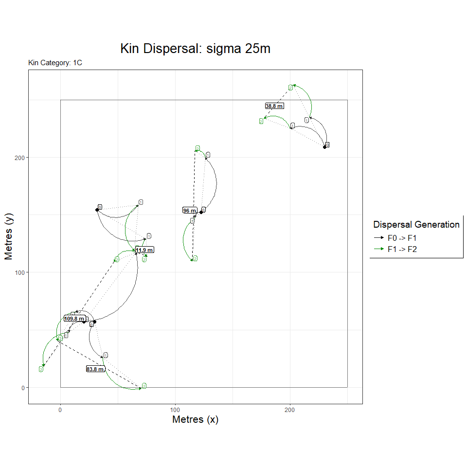
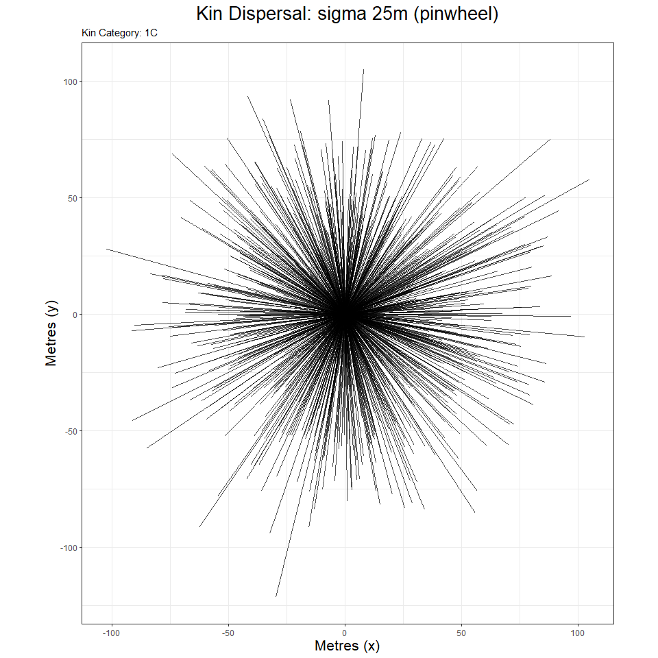
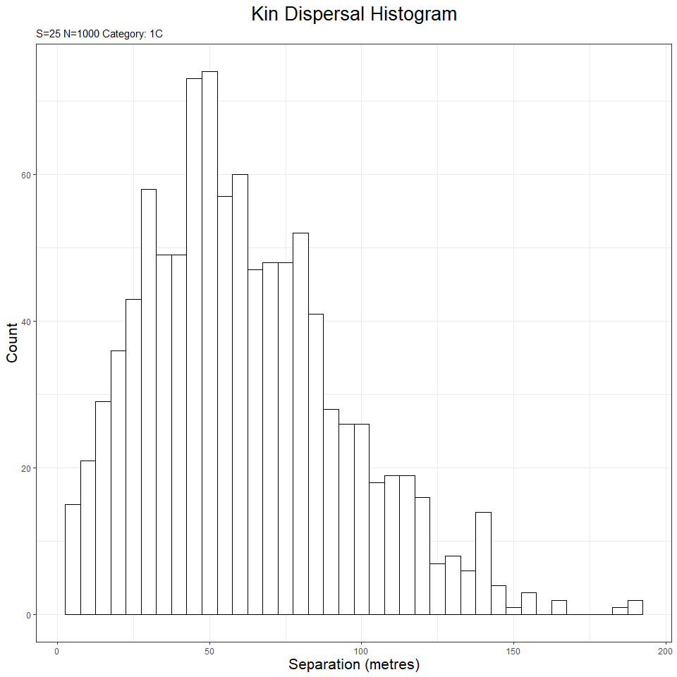

KINDISPERSE 0.10.1
================

-   [1. Introduction](#1-introduction)
-   [2. Installation](#2-installation)
-   [3. The shiny app](#3-the-shiny-app)
    -   [3.1 Running the app](#31-running-the-app)
    -   [3.2 External interface](#32-external-interface)
-   [4. The R package](#4-the-r-package)
    -   [4.1 Simulations and Sampling](#41-simulations-and-sampling)
    -   [4.2 Data Management](#42-data-management)
    -   [4.3 Estimating dispersal](#43-estimating-dispersal)
    -   [4.4 Adapting to a new species:
        *Antechinus*](#44-adapting-to-a-new-species-antechinus)

<!-- README.md is generated from README.Rmd. Please edit that file -->
<!-- badges: start -->
<!-- badges: end -->

The goal of kindisperse is to simulate and estimate close-kin dispersal
kernels.

# 1. Introduction

Dispersal is a key evolutionary process that connects organisms in space
and time. Assessing the dispersal of organisms within an area is an
important component of estimating risks from invasive species, planning
pest management operations, and evaluating conservation strategies for
threatened species.

Assessing the dispersal of small, abundant and short-lived animals such
as insects has traditionally been more difficult than for animals that
can be easily tagged. Responding to this challenge, researchers have
developed various methods based around mark-release-recapture that mark
the organisms with dyes, paint, or chemical tags, before releasing the
individuals and in various ways measuring the number of recaptures.

Such methods suffer the limitations of requiring manipulation of the
same individuals in which dispersal is being assessed, are
labour-intensive when conducted across a large enough area to be
informative, and typically are not estimates of true intergenerational
dispersal (which is measured life-stage to life-stage, e.g. from the egg
of the parent to the egg of its offspring). Such life-stage to
life-stage estimates are important as they are readily interpretable
within established intergenerational analytic frameworks such as
Wright’s neighbourhood size.

Leveraging decreases in sequencing costs, out new method instead
estimates dispersal from the spatial distribution of close-kin. This
method requires that close kin dyads be identified and scored for two
variables: (i) the geographical distance between the two individuals in
the dyad, and (ii) their estimated order of kinship (1st order
e.g. full-sib; 2nd order e.g. half-sib; 3rd order e.g. first cousin).

Close-kin-based dispersal can provide an estimate of the
intergenerational (or parent-offspring) dispersal kernel - a key factor
that connects biological events across the lifespan of an organism with
broader demographic and population-genetic processes such as isolation
by distance. A dispersal kernel is the probability density function
describing the distributions of the locations of dispersed individuals
relative to the source point. Intergenerational dispersal kernels
themselves can be framed in terms of any number of breeding and
dispersal processes, defined by both reference life-stage and number of
generations, and leave their mark in the spatial distribution of various
categories of close kin, which can be treated as samplings from a set of
underlying kernels. Actual kernels vary, but are typically described in
terms of sigma, the second moment of the kernel, also known as its scale
parameter. More complex kernels can also incorporate a parameter for
shape or kurtosis (kappa), representing the fourth moment of the kernel.

In the case of an insect like the mosquito, the most basic
intergenerational kernel, the lifespan or parent-offspring kernel,
reflects all dispersal and breeding processes connecting (e.g.) the
immature (egg, larval, pupal) location of a parent to the immature
location of its offspring. However, this kernel can be combined with
additional breeding, dispersal and sampling events to produce other,
composite dispersal or distribution kernels that contain information
about intergenerational dispersal. For example, the distribution of two
immature full-sibling mosquitoes reflects not a full lifespan of
dispersal, but two ‘draws’ from the component kernel associated with the
mother’s ovipositing behaviour. Were we to sample the same full-sibling
females as ovipositing adults, this would instead represent two draws
from a composite ‘lifespan and additional oviposition’ kernel. Avuncular
larvae, should they exist, would represent draws from related but
distinct intergenerational dispersal kernels - an oviposition kernel,
and a composite ‘oviposition and lifespan’ kernel. The avuncular
distribution kernel would thus reflect a further compositing of these
dispersal events.

There is a rich literature examining the kernels of basic dispersal
events, and analysing them in terms of various kernel functions, whether
Gaussian, exponential, or others with differing properties and shapes,
often reflecting the tendency of dispersal events to be
disproportionately clustered around the source and/or be dispersed at
great distances from the source (i.e. for the kernel to be fat-tailed).
Most of this literature explores dispersal in terms of probability of a
dispersed sample being at a certain radius from the dispersed source. In
the case of close-kin recaptures of e.g. first cousins, we are instead
presented with dispersal events that must be approached in two
dimensions with respect to both radius of dispersal and additionally
angle of dispersal. A successful estimator of intergenerational
dispersal using close-kin recaptures must find strategies to decompose
the extraneous spatial and breeding components affecting the kernels,
and ultimately re-express dispersal in terms of an axial sigma - that
aspect of dispersal which operates within one dimension across a
two-dimensional space. This is the sigma component relied upon by
[Wright (1946)](https://www.ncbi.nlm.nih.gov/pmc/articles/PMC1209315/)
for isolation by distance , and which is reflected in estimations of
neighbourhood area.

The method we have developed relies upon the fact that different kinship
categories reflect different but related underlying intergenerational
dispersal composites, and uses the relationships between these kinship
distribution kernels to extract information about the core
parent-offspring dispersal kernel that produced the derivative kernels.
For example, the immature distribution kernel of full siblings differs
from the immature distribution of first cousins by a single lifespan:
using an additive variance framework, the first cousin variance that is
not accounted for by subtracting the full sibling variance constitutes
an estimate of the parent-offspring distribution, from which an
intergenerational kernel estimate can be derived. This is because both
immature full-sibling and immature first cousins are ‘phased’ with
respect to the organisms’ life cycle - that is, they are separated by an
integer multiple of parent-offspring dispersal events. It is this
phasing that enables the extraction of a ‘pure’ effective dispersal
estimate, via the additive property of variance. Other examples of
phased relationships include half sibling immatures to half cousin
immatures (one cycle), full sibling immatures to second cousin immatures
(two cycles), or even (for mosquitoes) full sibling immatures to second
cousin ovipositing adults (three cycles).

Further details can be found in [Jasper et
al. (2019)](https://doi.org/10.1111/1755-0998.13043) “A genomic approach
to inferring kinship reveals limited intergenerational dispersal in the
yellow fever mosquito”.

This package supplements these papers by supplying methods for (a)
importing and exporting information about distances & kinship
relationships for pairs of individuals, (b) estimating the axial
distribution (axial sigma for dispersal or position distributions) from
empirical distributions of kin-pairs, and (c) estimating the
intergenerational (parent-offspring) dispersal distribution (axial
sigma) that underlies the distributions of multiple phased kin
categories. This package also implements several simulation tools for
further exploring and testing the properties of intergenerational
dispersal kernels, as well as to assist in designing experiment layouts
& sampling schemes. Finally, for ease of use, the package supplies an
integrated shiny app which also implements the vast majority of package
functionality in a user-friendly interface.

# 2. Installation

You can install the released version of kindisperse from
[CRAN](https://CRAN.R-project.org) with: (in future. this doesn’t
currently exist)

``` r
install.packages("kindisperse")
```

And the development version from [GitHub](https://github.com/) with:

``` r
# install.packages("devtools")
devtools::install_github("moshejasper/kindisperse")
```

Once installed, load the package as follows:

``` r
library(kindisperse)
#> kindisperse 0.10.1
```

# 3. The shiny app

The kindisperse app bundles most of the tools supplied in this package
for ease of use.

## 3.1 Running the app

To run the app, enter the function `run_kindisperse()` and in a moment
the app will appear in a separate window. To close, exit this window, or
alternatively hit the ‘stop’ button or equivalent in RStudio.

## 3.2 External interface

To calculate axial values, etc. of objects within the app, they first
must be passed to the app from the computer or the R package
environment. One option is to save objects to the computer via either
.csv or .kindata formats, then load them using the in-app interface.

Alternatively, objects you have loaded or created in the R package
environment can be passed to the app by first mounting them to the
special `appdata` environment which can be accessed from within the app
via the `Load` tab. Mounted objects must be of class `KinPairData` or
`KinPairSimulation`. To mount an object, use the
`mount_appdata(obj, "nm")` function (unmount with
`unmount_appdata("nm")`). The `appdata` environment can be viewed with
`display_appdata()` and cleared with `reset_appdata()`. Objects mounted
to appdata from within the app can also be retrieved with
`retrieve_appdata()` or `retrieveall_appdata()`.

``` r
fullsibs <- simulate_kindist_composite(nsims = 100, ovisigma = 25, kinship = "FS")
reset_appdata()
mount_appdata(fullsibs, "fullsibs")
display_appdata()
#> <environment: kindisperse_appdata>
#> parent: <environment: namespace:kindisperse>
#> bindings:
#>  * fullsibs: <KnPrSmlt>
fullsibs2 <- retrieve_appdata("fullsibs")
reset_appdata()
```

The app also uses a temporary environment for in-app data handling and
storage. Following a session, objects stored in this space can be
bulk-accessed via the function `retrieve_tempdata()`, and reset via the
function `reset_tempdata()`.

# 4. The R package

Package functions and typical usage are introduced below

## 4.1 Simulations and Sampling

KINDISPERSE is is built to run three types of simulation. The first is a
graphical simulation showing the dispersal of close kin over several
generations. The second and third are both simulations of close kin
dyads, one using a simple PO kernel, the other a composite one. The
package also includes one subsampling function to assist in using these
simulations for field study design.

### 4.1.1 Graphical simulations

This is designed primarily for introducing, exploring, and easily
visualising dispersal concepts. It is packaged in two parallel
functions: the simulation function (`simgraph_data()`) and the
visualisation function(`simgraph_graph()`). A standard example of their
use is shown below, in this case, modeling families including first
cousins with a kernel sigma of 25m, and site dimensions of 250x250m. The
first graph shows the dispersal events leading to first cousins within
five of these families.

``` r
## run graphical simulation
graphdata <- simgraph_data(nsims = 1000, posigma = 25, dims = 250)
simgraph_graph(graphdata, nsim = 5, kinship = "1C")
```



However, the options of both can be tweaked to show other data types,
e.g. a pinwheel graph focused on 1,000 first cousin dyads.

``` r
graphdata <- simgraph_data(nsims = 1000, posigma = 25, dims = 250)
simgraph_graph(graphdata, nsims = 1000, pinwheel = T, kinship = "1C")
```



or a histogram of first cousin dyads:

``` r
graphdata <- simgraph_data(nsims = 1000, posigma = 25, dims = 250)
simgraph_graph(graphdata, nsims = 1000, histogram = T, kinship = "1C")
```



The simgraph functions are also implemented in the ‘Tutorial’ tab of the
kindisperse app.

### 4.1.2 Kinpair Simulations

These are designed for simulating and testing the impacts of various
dispersal and sampling parameters on a dataset, and for testing and
validating the estimation functions. They return an object of class
`KinPairSimulation`, which supplies a tibble (dataframe) of simulation
results, as well as metadata capturing the simulation parameters.

Three kernel types are supported for the next two simulations at
present: `Gaussian`, `Laplace`, and `vgamma` (variance-gamma). These are
passed to the functions with the `method` parameter. If using vgamma,
also supply its shape parameter with the argument `shape`. Small values
of `shape` correspond to an increasingly leptokurtic kernel - i.e. a
strong central clustering with an increased number of very widely spaced
individuals (long tails).

The simple simulation, `simulate_kindist_simple()`, simulates
intergenerational dispersal for each kin category based on a simple
parent-offspring dispersal sigma, with no attempt to distinguish between
the various breeding and dispersal events across a lifespan. For this
reason, it cannot distinguish between full and half siblings (for
example), as immature full and half siblings have been separated by less
than a lifespan’s worth of dispersal; it would render them as at
distance 0 from their parent (if they were in the adult oviposition
stage, however, they would be rendered as at one lifespans’ dispersal
from parents).

Example usage is shown below:

``` r
simulate_kindist_simple(nsims = 5, sigma = 100, method = "Gaussian", kinship = "PO", lifestage = "immature")
#> KINDISPERSE SIMULATION of KIN PAIRS
#> -----------------------------------
#> simtype:      simple 
#> kerneltype:       Gaussian 
#> kinship:      PO 
#> simdims:      100 100 
#> posigma:      100 
#> lifestage:        immature 
#> 
#> tab
#> # A tibble: 5 x 8
#>   id1   id2   kinship distance    x1     y1     x2     y2
#>   <chr> <chr> <chr>      <dbl> <dbl>  <dbl>  <dbl>  <dbl>
#> 1 1a    1b    PO          51.0 43.1  50.9     20.5   5.20
#> 2 2a    2b    PO         140.   8.84 89.4    -81.8 -17.7 
#> 3 3a    3b    PO         155.  32.2  68.0   -120.   95.5 
#> 4 4a    4b    PO         199.  12.0  29.9   -182.   74.6 
#> 5 5a    5b    PO         100.  35.2   0.874   71.8  94.4 
#> -----------------------------------
```

The composite simulation, `simulate_kindist_composite()`, defines four
smaller dispersal movements which make up the lifestage dispersal
kernel. It distinguishes between full and half siblings, cousins, etc.
and handles immature kin dyads that are separated by less than a
lifespan of dispersal (e.g. immature FS). The four phases are ‘initial’
(handling any dispersal between hatching and breeding), ‘breeding’
(movement of the male across the breeding aspect of the cycle), ‘gravid’
(movement of the female after breeding but before deposition of young),
and ‘oviposition’ (movement made while ovipositing/ bearing young). The
addition of the variances of these four kernels together consitutes the
lifespan dispersal kernel; the relationships between different
categories inform the phase. For example, full-siblings, whether sampled
at oviposition or immature states, differ in hatch position based on the
ovipositing movements of the mother (including e.g. skip oviposition in
the case of some mosquitoes). These categories (and any others
containing a full-sib relationship buried in the pedigree) are thus of
the ‘full-sibling’ or ‘FS’ phase. Half siblings, in mosquitoes (which
this package is modelled on) are expected to be due to having the same
father & separate mothers: the last contribution of the father’s
dispersal is at the breeding stage, so the ‘HS’ phase are differentiated
by the breeding, gravid, & oviposition phases, but share in common the
initial phase. The parent-offspring ‘PO’ phase, on the other hand, share
all (or none) of the component dispersal distributions.

An example composite simulation is demostrated below:

``` r
simulate_kindist_composite(nsims = 5, initsigma = 50, breedsigma = 30, gravsigma = 50, ovisigma = 10, method = "Laplace", kinship = "H1C", lifestage = "ovipositional")
#> KINDISPERSE SIMULATION of KIN PAIRS
#> -----------------------------------
#> simtype:      composite 
#> kerneltype:       Laplace 
#> kinship:      H1C 
#> simdims:      100 100 
#> initsigma         50 
#> breedsigma        30 
#> gravsigma         50 
#> ovisigma      10 
#> lifestage:        ovipositional 
#> 
#> tab
#> # A tibble: 5 x 8
#>   id1   id2   kinship distance     x1    y1    x2     y2
#>   <chr> <chr> <chr>      <dbl>  <dbl> <dbl> <dbl>  <dbl>
#> 1 1a    1b    H1C         406. -78.7   89.1  323.   25.6
#> 2 2a    2b    H1C         116. 153.    60.2  148.  176. 
#> 3 3a    3b    H1C         133.  83.8  -59.3  175. -156. 
#> 4 4a    4b    H1C         354.  25.7   22.1 -165. -276. 
#> 5 5a    5b    H1C         167.   8.99 150.   176.  141. 
#> -----------------------------------
```

Finally, a custom simulation function, `simulate_kindist_custom()`
enables the simulation of dispersal in organisms with breeding cycles
different to the original mosquito species this package was modeled for.
These simulations take a model object (of class `DispersalModel`,
generated with the function `dispersal_model()`) which contains detailed
information about breeding phases, the full sibling (FS) & half sibling
(HS) branch point, the sampling point, and further optional parameters
defining the accessible breeding cycle more carefully. We illustrate
this functions’s use in the context of implementing kindisperse in a new
species subsequently, but an initial example is given here. First, we
generate a custom dispersal model:

``` r
dmodel <- dispersal_model(juvenile = 50, breeding = 40, gestation = 30, .FS = "juvenile", .HS = "breeding", .sampling_stage = "gestation")
dmodel
#> KINDISPERSE INTERGENERATIONAL DISPERSAL MODEL
#> ---------------------------------------------
#> stage:        juvenile   breeding    gestation 
#> dispersal:    50 40  30 
#> 
#> FS branch:    juvenile 
#> HS branch:    breeding 
#> sampling stage:   gestation 
#> cycle:        0 0 
#> ---------------------------------------------
```

Next, we use this model to simulate dispersal in our organism:

``` r
simulate_kindist_custom(nsims = 5, model = dmodel, kinship = "PO")
#> KINDISPERSE SIMULATION of KIN PAIRS
#> -----------------------------------
#> simtype:      custom 
#> kerneltype:       Gaussian 
#> kinship:      PO 
#> simdims:      100 100 
#> juvenile              50 
#> breeding              40 
#> gestation             30 
#> cycle:            0 0 
#> lifestage:        gestation 
#> 
#> tab
#> # A tibble: 5 x 8
#>   id1   id2   kinship distance    x1    y1     x2     y2
#>   <chr> <chr> <chr>      <dbl> <dbl> <dbl>  <dbl>  <dbl>
#> 1 1a    1b    PO          76.8 91.5   83.0  15.3    93.2
#> 2 2a    2b    PO          45.0 51.0   69.8   6.59   62.2
#> 3 3a    3b    PO          94.2 88.3   70.4 106.    -22.2
#> 4 4a    4b    PO         131.  92.9   62.7 -21.8   125. 
#> 5 5a    5b    PO         168.   6.92  17.5 111.   -114. 
#> -----------------------------------
```

### 4.1.3 Simulating Field Sampling of Kinship Distributions

This is done via another function, `sample_kindist()`, and enables the
examination of how field sampling conditions could bias the estimation
of axial sigma. It works with the `KinPairSimulation` or `KinPairData`
classes and filters based on the study area size, number of kin expected
to be found, & trap spacing. It is demonstrated below.

``` r
compsim <- simulate_kindist_composite(nsims = 100000, kinship = "H2C")

sample_kindist(compsim, upper = 1000, lower = 200, spacing = 50, n = 25)
#> Removing distances farther than 1000
#> Removing distances closer than 200
#> Setting trap spacing to 50
#> Down-sampling to 25 kin pairs
#> 25 kin pairs remaining.
#> KINDISPERSE SIMULATION of KIN PAIRS
#> -----------------------------------
#> simtype:      composite 
#> kerneltype:       Gaussian 
#> kinship:      H2C 
#> simdims:      100 100 
#> initsigma         100 
#> breedsigma        50 
#> gravsigma         50 
#> ovisigma      25 
#> lifestage:        immature 
#> 
#> FILTERED
#> --------
#> upper:            1000 
#> lower:            200 
#> spacing:      50 
#> samplenum:        25 
#> 
#> tab
#> # A tibble: 25 x 8
#>    id1    id2    kinship distance     x1     y1     x2     y2
#>    <chr>  <chr>  <chr>      <dbl>  <dbl>  <dbl>  <dbl>  <dbl>
#>  1 39474a 39474b H2C          475   66.9 -101.   541.  -117. 
#>  2 44245a 44245b H2C          375  -29.2 -242.    85.8   98.7
#>  3 1688a  1688b  H2C          675  504.   356.   -67.6   19.7
#>  4 70821a 70821b H2C          375 -422.   -36.1 -106.   123. 
#>  5 68877a 68877b H2C          375  206.  -122.    35.2  194. 
#>  6 46338a 46338b H2C          325 -180.    76.4   83.3  -99.2
#>  7 97001a 97001b H2C          225  317.   120.   202.   -51.1
#>  8 31882a 31882b H2C          275  -24.9  -18.8  -30.1  261. 
#>  9 39623a 39623b H2C          525 -303.   188.   209.   233. 
#> 10 12789a 12789b H2C          575  380.   -21.3 -205.   -12.9
#> # ... with 15 more rows
#> -----------------------------------
```

## 4.2 Data Management

### 4.2.1 Reading & writing files

Files can be loaded and saved to & from three separate formats: .csv and
.tsv (via functions `csv_to_kinpair()`, `tsv_to_kinpair()`, or to save,
`kinpair_to_csv()` & `kinpair_to_tsv()`, as well as the package-specific
.kindata format which wraps an rds file storing package objects (via
functions `read_kindata()` and `write_kindata()`). These files read to
or save from an object of class `KinPairData` (including simulation
objects of class `KinPairSimulation`).

.csv or equivalent files used should have a single column with the
header ‘distance’ that contains the geographical distances between kin
pairs, and preferably another column labelled ‘kinship’ which carries
the kinship category in a form recognized by this package (see
documentation for further details). Example below:

``` r
kinobject <- simulate_kindist_simple(nsims = 25, kinship = "FS", lifestage = "immature")
#kinpair_to_csv(kinobject, "FS_kin.csv") # saves file
#csv_to_kinpair("FS_kin.csv") # reloads it
```

### 4.2.2 Converting objects to KinPairData format

Within the package, there are several ways to convert measures of kin
dispersal distances into the `KinPairData` format required for
calculations of axial distance: `vector_to_kinpair()` which takes a
vector of kinpair distances, and `df_to_kinpair()` which takes a
`data.frame` or `tibble` with a similar layout to the `.csv` files
mentioned earlier (column of geographical distances labelled ‘distance’
and optional columns of kin categories (‘kinship’) and lifestages
(’lifestage)). Inverse function is `kinpair_to_tibble()`. See relevant
documentation. Example below:

``` r
kinvect <- c(25, 23, 43, 26, 14, 38)

vector_to_kinpair(kinvect, kinship = "H1C", lifestage = "immature")
#> KINDISPERSE RECORD OF KIN PAIRS
#> -------------------------------
#> kinship:      H1C 
#> lifestage:        immature 
#> cycle:            0 
#> 
#> tab
#> # A tibble: 6 x 4
#>   id1   id2   kinship distance
#>   <chr> <chr> <chr>      <dbl>
#> 1 1a    1b    H1C           25
#> 2 2a    2b    H1C           23
#> 3 3a    3b    H1C           43
#> 4 4a    4b    H1C           26
#> 5 5a    5b    H1C           14
#> 6 6a    6b    H1C           38
#> -------------------------------
```

Once converted, in most cases these `KinPairData` objects can be sampled
in the same way as the simulations above with the function
`sample_kindata()`.

## 4.3 Estimating dispersal

The package contains a series of functions to estimate and manipulate
axial sigma values (axial distributions) of simulated and empirical
close-kin distributions, as well as to leverage several such
distributions of related categories to supply a bootstrapped estimate of
the intergenerational dispersal kernel axial sigma.

### 4.3.1 Basic estimation of axial sigma

Axial sigma is most simply estimated with the function
`axials(x, composite = 1)`. This function estimates the axial value of a
simple kernel assuming that all distances measured represent one
dispersal event governed by the kernel (e.g. the distance between a
parent and their offspring at the equivalent lifestage, such as both as
eggs). For slightly more complex situations, such as full siblings,
where the distances between them result from two or more draws from the
**same** underlying distribution (ovipositing parent to offspring \#1,
ovipositing parent to offspring \#2), the value of `composite` can be
adjusted to reflect the number of such symmetrical component events(for
this specific case, you can also use `axials_norm()`). (e.g. the
great-grandparent to great-grandchild category, ‘GGG’ is a combination
of three draws from the PO distribution, and thus would take
`composite = 3`):

``` r
paroff <- simulate_kindist_simple(nsims = 1000, sigma = 75, kinship = "PO")
axials(paroff)
#> [1] 75.40432
```

``` r
fullsibs <- simulate_kindist_composite(nsims = 10000, ovisigma = 25, kinship = "FS")
axials(fullsibs, composite = 2)
#> [1] 24.98305
```

Various auxillary functions exist to further manipulate axial distances
within an additive variance framework, enabling the stepwise combination
or averaging or decomposition of axial sigma values representing
different distributions. These include `axials_decompose()` (divides
into component parts as in the composite option above), `axials_add()`
(adds two distributions together, e.g. FS + FS + PO + PO = 1C),
`axials_combine()` (mixes two distributions together equally, e.g. 1C &
H1C becomes the distribution of an even mix of both), and
`axials_subtract()` subtracts a smaller distribution from a greater
distribution to find the residual distribution (e.g. GG - PO = PO;
FS(immature) - FS(ovipositional) = PO). For confidence intervals, there
are also the permuting functions `axpermute()` and
`axpermute_subtract()`.

``` r
axials_subtract(24, 19)
#> [1] 14.66288
```

### 4.3.2 Estimation of axial sigma of intergenerational (PO) dispersal

Building on the above functions, the final estimation function
`axials_standard()` and its permuted implementation
`axpermute_standard()` take information about dispersal information
across several phased categories and use it to make an estimate of the
core, parent-offspring dispersal kernel (defined by axial sigma). Using
this equation requires knowing representative spatial distributions of
at least two **phased** kinship classes that are separated by at least
one complete lifespan. In some cases, this phased requirement can be met
by compositing two known distributions to approximate the distribution
of a mixed category (e.g. mixing FS & HS categories to create a
composited category that can be compared to an undistinguishe mixture of
1C & H1C individuals).

The function works by subtracting out the phased component of the
distributions (e.g. the additional oviposition present in FS & 1C)
leaving the residual lifespan components, then decomposing these down to
a single span. When bootstrapped as in the `axpermute_standard()`
function, these equations output the 95% confidence intervals of the
resulting PO sigma estimate, as well as the estimate of median sigma.
This estimate is the same sigma that interacts with Wright’s
neighbourhood size (the radius of NS is equal to 2x the axial sigma
estimate).

Let’s try out some simulated values see the function in action. First,
we’ll set up our individual axial sigmas for the component
distributions.

``` r
# set up initial sigma values

init = 50
brd = 25
grv = 75
ovs = 10

# calculate theoretical PO value
po_sigma <- sqrt(init^2 + brd^2 + grv^2 + ovs^2)
po_sigma
#> [1] 94.07444
```

Here we have set up a baseline of the theoretical value of the
intergenerational kernel (axial) sigma for comparison below.

First, a simple example (full sibs & first cousins) - note that the
larger value must be inputted first, i.e. as `avect` in the equation.
Because they are simulated objects, categories don’t need to be
supplied.

``` r
# set up sims

fullsibs <- simulate_kindist_composite(nsims = 75, initsigma = init, breedsigma = brd, gravsigma = grv, ovisigma = ovs, kinship = "FS")

fullcous <- simulate_kindist_composite(nsims = 75, initsigma = init, breedsigma = brd, gravsigma = grv, ovisigma = ovs, kinship = "1C")

# calculate PO axial sigma C.I. 

axpermute_standard(fullcous, fullsibs)
#>     2.5%     mean    97.5% 
#> 76.31434 85.58158 94.92273
```

As we can see, the C.I. neatly brackets the actual axial value, though
with fairly large wings due to the small sample size. Now we set up a
more complex case, involving a mixture of full & half cousins and a
compensating compositing of full & half siblings (this will involve some
data-wrangling):

``` r
# Set up new distributions
halfsibs <- simulate_kindist_composite(nsims = 75, initsigma = init, breedsigma = brd, gravsigma = grv, ovisigma = ovs, kinship = "HS")

halfcous <- simulate_kindist_composite(nsims = 75, initsigma = init, breedsigma = brd, gravsigma = grv, ovisigma = ovs, kinship = "H1C")

# combine cousin distributions & recompose as object. Chaning kinship
# to standard value for unknown as I will be combining the distributions. 
fc <- dplyr::mutate(kinpair_to_tibble(fullcous), kinship = "UN")
hc <- dplyr::mutate(kinpair_to_tibble(halfcous), kinship = "UN")
cc <- tibble::add_row(fc, hc) 
cousins <- df_to_kinpair(cc)
cousins
#> KINDISPERSE RECORD OF KIN PAIRS
#> -------------------------------
#> kinship:      UN 
#> lifestage:        immature 
#> cycle:            0 
#> 
#> tab
#> # A tibble: 150 x 9
#>    id1   id2   kinship distance     x1    y1     x2     y2 lifestage
#>    <chr> <chr> <chr>      <dbl>  <dbl> <dbl>  <dbl>  <dbl> <chr>    
#>  1 1a    1b    UN          87.3  186.   87.9  104.  118.   immature 
#>  2 2a    2b    UN         129.   -48.8  60.1  -27.6 -67.4  immature 
#>  3 3a    3b    UN         217.   120.  213.   -61.8  94.8  immature 
#>  4 4a    4b    UN         121.   132.   34.4   12.7  51.2  immature 
#>  5 5a    5b    UN         179.   -89.4  57.3   86.6  91.1  immature 
#>  6 6a    6b    UN          30.0  -57.2  57.8  -72.0  31.7  immature 
#>  7 7a    7b    UN         194.   227.  -28.7   44.9  39.9  immature 
#>  8 8a    8b    UN         176.   253.  148.    79.3 180.   immature 
#>  9 9a    9b    UN         307.   142.  -95.2 -149.    4.61 immature 
#> 10 10a   10b   UN         200.  -182.   74.1   12.4  26.6  immature 
#> # ... with 140 more rows
#> -------------------------------
```

Note this is now a `KinPairData` object rather than a
`KinPairSimulation`. The conversion to tibble and back has stripped the
simulation class data. Now to run the estimation function, supplying
missing category data:

``` r
# amix allows supply of additional (mixed) kin category H1C to acat 1C;
# bcomp allows supply of distribution to composite with bvect (this is done to match 
# the cousin mixture in phase)
axpermute_standard(avect = cousins, acat = "1C", amix = TRUE, amixcat = "H1C", bvect = fullsibs, bcomp = TRUE, bcompvect = halfsibs)
#>     2.5%     mean    97.5% 
#> 70.99072 83.02151 93.23848
```

This estimate is a lot more convoluted, and not as ‘spot on’- but the
theoretical value of 94 is well within the confidence intervals.

## 4.4 Adapting to a new species: *Antechinus*

Using the recently added (as of 0.10.1 & higher) custom dispersal
simulations & parameters, we are well placed to explore what is
typically involved in adapting this method & package to a species with a
different life history & breeding structure to that of *Ae. aegypti* &
other related species. The example chosen here is a species of
*Antechinus* - a small marsupial native to Australia. Note that this
example is for illustrative purposes only.

### 4.4.1 Assemble known background information

Breeding & dispersal can be highly diverse processes between organisms -
simply copying and pasting a method from one species to another without
careful consideration of their differences & unique contexts is unwise.
What relevant information can we find about species of *Antechinus*?

For *Antechinus*, mating takes place across a single week each year, &
is promiscuous. Males only mate once, & die shortly after mating.
Females live up to two years, producing two litters in that time. Each
litter will likely contain offspring from multiple males ([Cockburn et
al. 1985](https://doi.org/10.1016/S0003-3472(85)80025-7)). In the same
paper, Cockburn et al. recognize seven life history stages:

1.  Pouch young (5-7 weeks)  
2.  Nest young (8-10 weeks)  
3.  Juveniles (rest of year)
4.  Reproductives (2 weeks)
5.  Mothers (4-5 weeks gestation)
6.  2nd yr repro. (female)
7.  2nd yr mothers (female)

Pouch young exhibit obligatory attachment to the mother’s teat. Nest
young still feed on the teat, but are left in the nest (typically a hole
in a tree) when the mother forages for food, until weaning. Juveniles
describe the post-weaning, physiologically independent animals before
synchronised reproduction occurs. This interval covers most of the first
year. Reproductives (male & female) describe the animals within the very
short mating window each year (males mate with multiple females, & vice
versa). Mothers covers pregnancy, lactation (overlapping with nest &
pouch young) & post-lactation (overlapping with the juvenile phase).

Natal dispersal (occuring after weaning) is strongly male-biased
([Cockburn et al. 1985](https://doi.org/10.1016/S0003-3472(85)80025-7)),
with males dispersing from the nest & often from the maternal home
range, while females dispersal is more localised. In that time, males
can disperse over hundreds of meters - in some species (e.g. *Antechnius
stuartii*), more than a kilometre ([Banks & Lindenmayer
2014](https://doi.org/10.1016/S0003-3472(85)80025-7)). Female dispersal
is not frequently beyond 50 metres [Fisher
2005](https://doi.org/10.1071/ZO04068).

### 4.4.2 Identify useful life stages & kinship categories

Our key research questions will drive which aspects of the above life
history we want to focus on further. For this exercise, we want to be
able to estimate parent-offspring dispersal so that we can gain an
estimate of the neighbourhood area. Importantly, we need this estimate
to get around the sex-biased disersal in this species.

Let’s define a life cycle. Pouch & nest young are still completely
dependent on the mother, so will show no independent dispersal. We start
our description of a single intergenerational breeding cycle with the
juvenile stage, followed by breeding. We will break down the ‘mother’
lifestage into ‘gestation’ & ‘pouch’.

So, our basic breeding cycle will be something like: juvenile –&gt;
breeding –&gt; gestation –&gt; pouch.

What kinship categories do we expect to see in *Antechinus* populations?
Let’s break this down by degree:

#### First degree kinship

Within this category we have the `PO` & `FS` classes. Full siblings
share the same mother, & the fathers only mate during one breeding
cycle, so we can expect all full siblings to be part of the same cohort,
& FS phased disperal to begin in the juvenile phase, as offspring leave
the nest.

#### Second degree kinship

The `HS` kinship class can be generated by a male mating with multiple
females, or a female mating with multiple males. Both of these have
different dispersal modes (the former is shaped by breeding dispersal,
the latter in a similar manner to the `FS` class). For our initial
simulation, we will only treat the former kind of `HS` dispersal. Note
that as females bear young over two generations, a third class of `HS`
is possible, between an adult female mother & the pouch young of her
(now 2nd yr) mother - cases like this are readily distinguishable by
other life history traits, e.g. age.

The `GG` kinship class (between 2nd yr mother & her grandchildren)

The `AV` kinship class (between an adult female & the offspring of her
full sibling - a partially sex-biased category)

#### Third degree kinship

Important categories here include `1C` & `HAV`. (`GAV` is also possible,
but clearly distinguishable by life history).

`1C` - first cousins. Part of same generational cohort & the `FS`
dispersal phase.

`HAV` - half avuncular. Most will be intergenerational (females of
previous generation to males & females of present generation). However,
Because females breed across two cycles, this category can occur within
the same generational cohort (see below).

`1C` individuals will be part of the same generational cohort & result
from parent-offspring dispersal events, making them a prime target
(along with the FS category) for developing an intergenerational
dispersal estimate. At first glance, this looks extremely
straightforward – but there is one issue.

### 4.4.3 Build a dispersal model

Armed with the above categories, we are well placed to put together a
rudimentary model of *Antechinus*. We will assign dispersal parameters
to approximately reflect what we consider important in the above. As we
are focusing on intergenerational dispersal in general, for now, we will
ignore sex-biased aspects of dispersal (though we will take them into
account when planning sampling).

``` r
antechinus_model <- dispersal_model(juvenile = 100, breeding = 50, gestation = 25, pouch = 25, .FS = "juvenile", .HS = "breeding", .sampling_stage = "juvenile")
antechinus_model
#> KINDISPERSE INTERGENERATIONAL DISPERSAL MODEL
#> ---------------------------------------------
#> stage:        breeding   gestation   pouch   juvenile 
#> dispersal:    50 25  25  100 
#> 
#> FS branch:    juvenile 
#> HS branch:    breeding 
#> sampling stage:   juvenile 
#> cycle:        0 0 
#> ---------------------------------------------
```

Note that at this stage we have initially set sampling stage to
`juvenile` i.e. sampling free-living individuals before their first
breeding season. We will return to this later.

### 4.4.4 Build a custom dispersal simulation

We begin with a simple `PO` simulation.

``` r
library(magrittr)
ant_po <- simulate_kindist_custom(nsims = 10000, model = antechinus_model, kinship = "PO")
ant_po
#> KINDISPERSE SIMULATION of KIN PAIRS
#> -----------------------------------
#> simtype:      custom 
#> kerneltype:       Gaussian 
#> kinship:      PO 
#> simdims:      100 100 
#> breeding              50 
#> gestation             25 
#> pouch             25 
#> juvenile              100 
#> cycle:            0 0 
#> lifestage:        juvenile 
#> 
#> tab
#> # A tibble: 10,000 x 8
#>    id1   id2   kinship distance    x1    y1     x2    y2
#>    <chr> <chr> <chr>      <dbl> <dbl> <dbl>  <dbl> <dbl>
#>  1 1a    1b    PO         220.  11.6  89.8  -200.   29.4
#>  2 2a    2b    PO         174.  95.8   5.84  -76.7  27.6
#>  3 3a    3b    PO          68.7 29.7  44.9    91.8  74.1
#>  4 4a    4b    PO          63.1 90.8  92.4   125.  145. 
#>  5 5a    5b    PO         140.  85.1  48.1    91.7 -91.9
#>  6 6a    6b    PO          97.8 86.6  92.4   183.  110. 
#>  7 7a    7b    PO          64.7 12.8  89.6   -44.4  59.4
#>  8 8a    8b    PO         124.   5.90 93.4   114.  154. 
#>  9 9a    9b    PO          67.2 57.9  59.5    18.4 114. 
#> 10 10a   10b   PO         159.  99.6  81.2    77.2 -76.6
#> # ... with 9,990 more rows
#> -----------------------------------
```

Now we’ll use the `axials()` function to characterise our ‘default’
dispersal for the model:

`axials(ant_po)`: 118.3931736

The value is around 117 the ‘expected’ value of PO we should get back
from more complex estimation processes.

### 4.4.5 Validate axial dispersal estimates & refine model

For a basic PO estimation, we are going to combine the FS & 1C
categories:

``` r
ant_fs <- simulate_kindist_custom(nsims = 10000, model = antechinus_model, kinship = "FS")
ant_1c <- simulate_kindist_custom(nsims = 10000, model = antechinus_model, kinship = "1C")

axials_standard(ant_1c, ant_fs) # larger dispersal category goes first. 
#> [1] 117.8872
```

The FS/1C strategy has been validated theoretically - but an important
issue remains: the `HAV` category. While all males only breed during one
breeding season, in some *Antechinus* species, many females breed for a
second season. This means that a mother bear offspring in one breeding
season, and if both the mother and her offspring bore young in the
subsequent breeding season, as the young she bore would be related to
her previous litter as half-siblings, they are related to the last
litter’s offspring under the half-avuncular `HAV` kinship category. As
`HAV` is of the same order of kinship (3rd) as `1C`, and (via this
pathway) will be of the same lifestage, yet both pass through differing
dispersal routes, without further information it would be impossible to
use this class. Similar issues would hold for the `H1C` (half-cousin) &
`1C1` (first cousin once removed) categories at the fourth order of
kinship.

If we were simple sampling juvenile *Antechinus* as in our initial
setup, there would be no way to correct for this ambiguity in the data.
We need to include richer pedigree information to distinguish between
the various classes. Instead of sampling at the juvenile stage, let’s
switch the focus to females with pouch young, and instead of genotyping
one individual, plan to genotype all pouch young of a female:

``` r
antechinus_model <- dispersal_model(juvenile = 100, breeding = 50, gestation = 25, pouch = 25, .FS = "juvenile", .HS = "breeding", 
                                    .sampling_stage = "pouch", .breeding_stage = "breeding", .visible_stage = "juvenile")
antechinus_model
#> KINDISPERSE INTERGENERATIONAL DISPERSAL MODEL
#> ---------------------------------------------
#> stage:        juvenile   breeding    gestation   pouch 
#> dispersal:    100    50  25  25 
#> 
#> FS branch:    juvenile 
#> HS branch:    breeding 
#> sampling stage:   pouch 
#> cycle:        0 0 
#> ---------------------------------------------
```

Note that we have made several other previously implied model parameters
explicit this time also (the default values are preserved here, but the
concepts are important). Firstly, the `breeding_stage` parameter defines
which stage in the breeding cycle breeding actually occurs at. This is
by default anchored to the `HS` branch, but in situations where we might
with to model `HS` dispersal that begins later (e.g. where offspring
have multiple fathers but the same mother) - we might shift the `HS`
branch to the juvenile stage, but preserve our information on breeding
with this parameter. Second, the `visible_stage` parameter defines at
what point in the life cycle an individual is considered ‘available by
default for sampling’ in preference to its parent. This is by default
anchored to the `FS` branch, and approximates birth, hatching, etc. in
many species - but in many species (e.g. marsupials) an animal will be
born, but still attached to the parent from the perspective of
dispersal. In such situations, the `visible_stage` parameter describes
which individual will be sampled by default at an overlapping lifestage.
As in our model, `visible_stage` is anchored to the FS-branch juvenile
stage, the default sampled pouch individuals will be the mothers rather
than the offspring. In a simulation, the pouch offspring can be accessed
by setting the breeding cycle parameter to negative one.

### 4.4.6 Finalize target kinship categories

By sampling at this stage, we unlock four different kinds of
generational comparisons, all synced to the same life point: (1)
intra-pouch relationships (i.e. between different pouch young carried by
the same mother), (2) inter-pouch relationships (kinships between young
carried by different females), (3) kinship between adult females, and
(4) kinships between pouch young & adult females other than their
mother.

All of these categories can be combined with the genotypic data to
resolve pedigree information and enable more thorough calculations of
breeding dispersal, via the following resolution:

1.  FS between pouch young: this is now a trivial category, as these
    will be measured before any substantial dispersal has occurred
    within this category. This ‘zeroing’ of the FS phase will simplify
    additional relationships.
2.  HS between pouch young (same pouch) – these correspond to the
    portion of HS dispersal that results from multiple males mating with
    the same female. Also a trivial category.
3.  HS between pouch young (different pouches) as these have different
    maternal ancestors, they will share the same paternal ancestor. This
    category thus supplies a HS estimate of the combined breeding,
    gestational & pouch phases.
4.  FS between (female) parents. As the FS phase is zeroed this category
    constitutes an estimate of lifespan dispersal for *Antechinus*
    females. However, as dispersal within this species is sex-biased,
    this does doesn’t constitute the true intergenerational dispersal
    distance (for IBD, gene flow, etc.). – note that in this context all
    compared offspring are expected to fall into the 1C category.
5.  HS between (female) parents. These will result from a mixture of a
    shared male or female parent (i.e. the dispersal modes found in (b)
    & (c) above). This category thus contains the true HS phase in
    addition to a female-dispersed lifespan.
6.  3rd degree (female) parents. Depending on the species, it may be
    impossible to distinguish between the 1C & HAV kinships for
    individuals of this category.
7.  3rd degree between pouch young (different pouches). By themselves,
    this category will be indeterminate between the 1C & HAV categories.
    One approach would be to combine this category with category (f) to
    cancel out the composite phase & leave an estimate of PO dispersal –
    but as the more dispersed category are female adults, this would
    once again only produce an estimate of female dispersal across the
    breeding cycle. Is there another way?

Yes! We can check other pedigree relationships to distinguish between
the 1C & HAV categories. Firstly, we compare the parents. If they are
FS, their offspring are 1C & in isolation constitute an estimate of
female intergenerational dispersal as in (f) above. But an even more
useful test is to reciprocally cross-check the kinship between pouch
young & the mother of their putative cousins. If the two mothers were
not full siblings, we expect this pairing to produce an unrelated kin
category in the case of 1C offspring. However, in the HAV case, one of
the mothers must also be the grandmother of the other pouch young! This
would produce the 2nd degree (GG) relationship between the pouch young &
their grandmother. Thus, pedigree information helps us to distinguish
between HAV & 1C pouch young. Once 1C pouch young have been identified
(via all approaches) they will constitute an estimate of the elusive
intergenerational category PO (sex-independent). Similarly, the HAV
offspring where the GG individual is not the parent of the other mother
can be used to derive an estimate of male intergenerational dispersal!

For this reason, our key kinship category targets are:

1.  first cousins (pouch young)
2.  full siblings (pouch young) - a trivial but important category

Pedigree relationships we also need to test include:

1.  kinship between parents (to identify FS parents (1C offspring) as
    well as PO parents (HAV offspring))
2.  kinship between pouch young & non-parent females where a 1C/HAV
    relationship exists between offspring (if 2nd degree where parents
    are not FS, interpret as GG category, meaning offspring are HAV.
    Otherwise, interpret as 1C)

We run the initial simulations here: (setting the dispersal model to
vgamma to allow longer-tailed dispersal)

``` r
ant_1c_juv <- simulate_kindist_custom(nsims = 100000, model = antechinus_model, kinship = "1C", cycle = -1, method = "vgamma")
ant_1c_juv
#> KINDISPERSE SIMULATION of KIN PAIRS
#> -----------------------------------
#> simtype:      custom 
#> kerneltype:       vgamma 
#> kernelshape:      0.5 
#> kinship:      1C 
#> simdims:      100 100 
#> juvenile              100 
#> breeding              50 
#> gestation             25 
#> pouch             25 
#> cycle:            -1 -1 
#> lifestage:        pouch 
#> 
#> tab
#> # A tibble: 100,000 x 8
#>    id1   id2   kinship distance    x1     y1      x2     y2
#>    <chr> <chr> <chr>      <dbl> <dbl>  <dbl>   <dbl>  <dbl>
#>  1 1a    1b    1C         141.   103.  167.   243.    179. 
#>  2 2a    2b    1C         348.   143. -177.  -142.     22.8
#>  3 3a    3b    1C          41.0  184.   93.3  224.     85.7
#>  4 4a    4b    1C         156.   263.   40.6  230.   -112. 
#>  5 5a    5b    1C         341.   256.  -12.0  -67.8  -119. 
#>  6 6a    6b    1C         155.   148.  397.   248.    278. 
#>  7 7a    7b    1C         225.   103.  169.   -59.6    14.5
#>  8 8a    8b    1C         203.   165.  -69.0  272.    104. 
#>  9 9a    9b    1C         381.  -314. -104.    56.2   -16.3
#> 10 10a   10b   1C         171.   161.  125.    -3.95   78.7
#> # ... with 99,990 more rows
#> -----------------------------------
```

``` r
ant_fs_juv <- simulate_kindist_custom(nsims = 100000, model = antechinus_model, kinship = "FS", cycle = -1, method = "vgamma")
ant_fs_juv
#> KINDISPERSE SIMULATION of KIN PAIRS
#> -----------------------------------
#> simtype:      custom 
#> kerneltype:       vgamma 
#> kernelshape:      0.5 
#> kinship:      FS 
#> simdims:      100 100 
#> juvenile              100 
#> breeding              50 
#> gestation             25 
#> pouch             25 
#> cycle:            -1 -1 
#> lifestage:        pouch 
#> 
#> tab
#> # A tibble: 100,000 x 8
#>    id1   id2   kinship distance    x1    y1    x2    y2
#>    <chr> <chr> <chr>      <dbl> <dbl> <dbl> <dbl> <dbl>
#>  1 1a    1b    FS             0  8.65  6.17  8.65  6.17
#>  2 2a    2b    FS             0 20.0  89.8  20.0  89.8 
#>  3 3a    3b    FS             0 69.4  80.9  69.4  80.9 
#>  4 4a    4b    FS             0 68.6   9.47 68.6   9.47
#>  5 5a    5b    FS             0 33.0  51.1  33.0  51.1 
#>  6 6a    6b    FS             0 27.8  96.8  27.8  96.8 
#>  7 7a    7b    FS             0 86.2  91.7  86.2  91.7 
#>  8 8a    8b    FS             0  7.79 22.7   7.79 22.7 
#>  9 9a    9b    FS             0 99.6  79.5  99.6  79.5 
#> 10 10a   10b   FS             0 92.4  45.4  92.4  45.4 
#> # ... with 99,990 more rows
#> -----------------------------------
```

Inspecting the results, we see that the 1C category is well-dispersed,
while the FS category is entirely zero (FS offspring in the pouch are
not dispersed at all).

Finally, we run a simple PO estimation with these simulations (we
override a key check on the breeding cycle that would otherwise be
triggered by FS being used before their breeding cycle start point, as
they have not dispersed at all, so will not confound the estimate)

``` r
axpermute_standard(ant_1c_juv, ant_fs_juv, nsamp = 100, override = TRUE)
#>     2.5%     mean    97.5% 
#> 101.4440 117.7311 136.2437
```

This is excellent so far. Mean dispersal is still around 117, so
assuming sampling is adequate, this approach will lead us to
intergeneration dispersal.

### 4.4.7 Simulate sampling site & finalise study design

Now, before we go any further, we need to estimate how large a study
site we will need to gain an adequate understanding of dispersal, &
avoid missing rarer long-tailed dispersal events. We know that our FS
pouch young haven’t dispersed, so we won’t need to worry about them. But
what about the 1C category? At this point in an actual study, the
existing model should be refined as much as possible to provide
‘realistic’ estimates of dispersal at each stage (erring on the side of
larger estimates if uncertain).

Let’s check an initial sampling site of 100m by 100m:

``` r
ant_1c_juv %>% sample_kindist(dims = 100, n = 1000) %>% axpermute_standard(ant_fs_juv, nsamp = 100, override = TRUE)
#> Setting central sampling area to 100 by 100
#> Down-sampling to 1000 kin pairs
#> 1000 kin pairs remaining.
#>     2.5%     mean    97.5% 
#> 25.24243 27.64149 29.96157
```

A 100x100 meter sampling area is woefully inadequate (estimating the
kernel to only \~ 27m, well short of the 117 we need)! We try again,
this time in a 1km x 1km site:

``` r
ant_1c_juv %>% sample_kindist(dims = 1000, n = 1000) %>% axpermute_standard(ant_fs_juv, nsamp = 100, override = TRUE)
#> Setting central sampling area to 1000 by 1000
#> Down-sampling to 1000 kin pairs
#> 1000 kin pairs remaining.
#>      2.5%      mean     97.5% 
#>  90.78447 102.29387 114.65007
```

We are doing better here: with an average of \~100m. But we’re still 15%
short, and barely including the correct value in our C.I.s What about
2km x 2km?

``` r
ant_1c_juv %>% sample_kindist(dims = 2000, n = 1000) %>% axpermute_standard(ant_fs_juv, nsamp = 100, override = TRUE)
#> Setting central sampling area to 2000 by 2000
#> Down-sampling to 1000 kin pairs
#> 1000 kin pairs remaining.
#>      2.5%      mean     97.5% 
#>  94.51401 109.26972 123.36621
```

This estimate is acceptable, with a mean only a few meters short, & the
true value well within C.I.s. Accordingly, we make the decision to
sample within a grid of at least 2km by 2 km.

### 4.4.7 Run the study!

Now we are as prepared as possible to perform sampling, genotype
individuals, etc.

### 4.4.8 Load data & generate in-field dispersal estimates

Follow the instructions given in 4.2 & 4.3 to load sampledata into the
program & supply estimates. The `axials_standard` & `axials_permute`
functions contain the parameters `acycle` & `bcycle`, which enable the
calibration of the estimation process to pouch young (remember to use
the `override` parameter in this context). Or you could simply avoid
phase information, set the FS category to zero (as they are
non-dispersed), & perform a 1C-FS subtraction as is (which will
effectively just decompose the 1C into two PO increments - works in this
case as at the pouch phase we have synced FS dispersal to PO dispersal
(as all FS offspring coincide with maternal parent)).

### 4.4.9 Cross-check field estimates for bias & calibrate

Once you have generated in-field estimates of dispersal, it is always
good practice to substitute these estimate back into the original
simulation & rerun the sampling analysis in 4.4.7 again. If the new
estimate is significantly underestimated by the simulation after
subsampling to the dimensions of your study site, it is likely that the
study site is too small, & is biasing estimates of dispersal - one
approach from here would be to progressively increase the dispersal
amount until the new subsampled estimate matches the one generated by
the study (this will be a more likely figure for dispesal in the
species, and should inform future studies).

All the best with your own species & endeavours!
